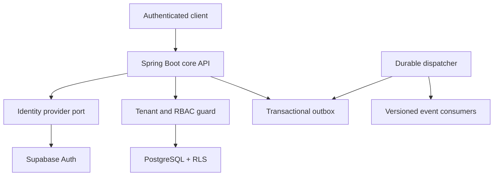
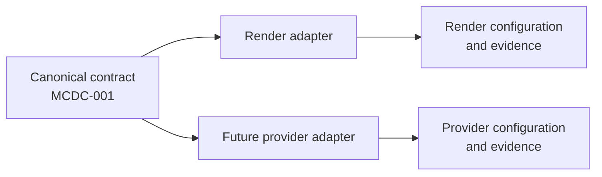

# Phase 1 architecture

## Outcome

Phase 1 creates the control plane on which later MyChandha domains will run. It
is deliberately a modular Spring Boot application rather than a collection of
networked microservices. Public delivery, webhook ingress, reporting, and
worker profiles can be extracted when those workloads exist.

## Runtime boundaries

The OCI artifact now supports separate `api`, `dispatcher`, and `migration`
profiles. The `local` profile may compose API and dispatcher behavior only for
developer convenience. Render is the first deployment adapter. Gate C now
provides a validated, non-live mapping for API and dispatcher processes;
materialization, migration execution, and provider resources remain
unapproved.

The approved readiness target separates API, dispatcher, and migration
execution profiles while retaining one modular-monolith artifact. The decision
history is in `docs/adr/`, and capability/dependency rules are in
`docs/module-boundaries.md`.

## Deployment adapter boundary

`docs/deployment-contract.md` is the canonical provider-neutral deployment
specification. It defines logical processes, artifact identity, privilege and
secret isolation, health evidence, rollout order, rollback, and environment
capabilities. Provider configuration is an adapter to that contract, not an
application or domain dependency.

The initial Render adapter may choose Render service types and provider
configuration only to implement the canonical capabilities. It must not change
the OCI artifact, merge API/dispatcher/migration credentials, add an
infrastructure dependency, weaken health or evidence requirements, or leak a
Render type into domain/application modules.

Changing deployment providers therefore requires an adapter conformance review
under `CC-001`, not a redesign of product or domain behavior. The standard
evidence output is `EP-001` in `docs/evidence-package.md`.

## Request security sequence

1. The bearer token signature is validated against the configured Supabase JWKS.
2. Issuer, expiry, not-before, and `authenticated` audience are validated.
3. The identity adapter maps `sub`, email, and phone into an external identity.
4. `X-Organization-Id`, when supplied, is parsed as a UUID.
5. Active membership is checked with the requested organization bound to the
   transaction-local RLS setting.
6. A request-local organization context is established.
7. `@RequiresPermission` checks role/permission assignments.
8. Organization repositories execute only through `TenantJdbcExecutor`, which
   binds organization and actor with transaction-local `set_config`.
9. The context is removed in a `finally` block.

A tenant header selects a requested scope; it never grants access by itself.

## Identity boundary

`IdentityProvider` and `IdentityProviderRegistry` isolate provider claims from
application code. `SupabaseIdentityProvider` is the initial implementation.
Replacing Supabase requires a new adapter plus configuration, not changes to
tenant, audit, or future product modules.

The application stores provider/subject links and masked contact hints. It does
not store passwords, OTP secrets, access tokens, or refresh tokens.

## Persistence conventions

- PostgreSQL UUID identifiers; money-bearing modules will use minor units and
  ISO currency codes.
- Every organization-scoped row includes `organization_id`.
- RLS is mandatory for organization business tables. `FORCE ROW LEVEL
  SECURITY` is used where cross-tenant worker access is not required.
- API code uses transaction-local tenant settings, never session-persistent
  settings.
- Audit rows are append-only and hash-linked per organization. The exact
  canonical event representation is retained so integrity verification can
  reproduce every stored hash.
- Outbox events include aggregate identity, event type, schema version, tenant,
  correlation ID, retry state, and delivery timestamps.
- Inbox events deduplicate
  `(organization_id, source, external_event_id)` and detect payload
  substitution.
- Sensitive commands use `Idempotency-Key` with a request hash. Reusing a key
  for different input is a conflict; transaction-scoped advisory locks
  serialize concurrent use of the same key.
- Migrations are forward-only Flyway scripts. Production rollouts use
  expand/migrate/contract changes.

## Durable delivery

Domain changes and outbox rows must be written through the same
`TenantJdbcExecutor` transaction. The launch dispatcher uses
`FOR UPDATE SKIP LOCKED`, bounded exponential retry, claim ownership, and a
dead-letter state. Expired processing leases are reclaimed after a configurable
timeout so a worker crash cannot strand an event indefinitely. The
`EventTransport` port permits later Kafka adoption without changing domain
event contracts.

The platform outbox remains RLS-protected for ordinary queries. The dispatcher
has no direct table privileges and claims or transitions work only through the
V2 security-definer routines with fixed `search_path`, validated inputs, and
claim-ownership checks. The API role can enqueue tenant-bound rows but cannot
execute dispatcher routines or read the outbox directly.

## API conventions

- Versioned REST routes under `/api/v1`.
- RFC 9457 Problem Details with stable codes and correlation IDs.
- No PII in paths, correlation IDs, metrics, or logs.
- `ETag`/`If-Match` will protect mutable product resources.
- `Idempotency-Key` is required for sensitive commands.
- Cursor pagination and allow-listed filters/sorts will be used for large
  tables.

The normative versioning and RFC 9457 response contract is
`docs/api-contract.md`. The normative logging, metrics, tracing-compatibility,
and health categories are in `docs/observability-standards.md`.

## Deferred by design

Organization onboarding, verification, events, public pages, donations,
payments, refunds, receipts, finance, messaging, media, and billing begin in
later approval-gated phases.
