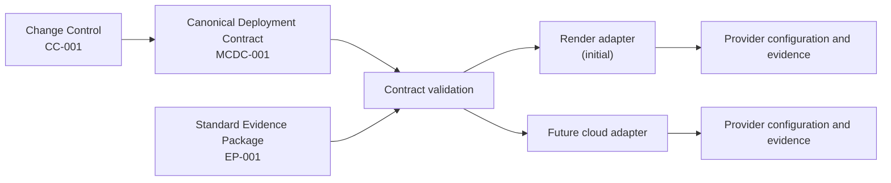

# Canonical deployment contract

Status: Normative specification
Contract identifier: `MCDC-001`
Current version: `1`

## Purpose

The MyChandha Deployment Contract is the provider-neutral description of what
an approved artifact requires to run safely. A deployment adapter maps this
contract to Render or a future platform. Provider configuration must not become
the architectural source of truth.

The contract separates:

- **application invariants** — artifact, profiles, privileges, health, release
  order, and evidence;
- **environment capabilities** — what local, CI, staging, and production must
  support; and
- **provider mapping** — how a selected provider implements those capabilities.

This is an operations architecture boundary, not a Java domain dependency.
No Render SDK, provider type, service identifier, or plan belongs in domain or
application modules.

## Normative language

`MUST`, `MUST NOT`, `SHOULD`, and `MAY` are requirements for every deployment
adapter and instantiated environment contract.

## Canonical contract model

An instantiated contract MUST contain the following sections:

| Section | Required content |
|---|---|
| `metadata` | Contract version, release identifier, environment class, approval reference, and creation time |
| `artifact` | Registry-neutral OCI reference, immutable manifest digest, platform, source commit, SBOM, scan, and evidence-manifest references |
| `processes` | Logical process ID, execution kind, active profiles, artifact reference, ingress, health contract, configuration allowlist, secret classes, and prohibited capabilities |
| `databaseBindings` | Logical database binding, least-privilege role class, TLS requirement, tenant/RLS expectation, and migration authority |
| `migration` | Short-lived execution contract, ordering, bootstrap prerequisite, failure behavior, and evidence outputs |
| `rollout` | Preconditions, process order, readiness and smoke gates, routing decision, and stop conditions |
| `rollback` | Prior digest, schema-compatibility decision, forward-fix boundary, restore boundary, and verification |
| `observability` | Required health, metrics, logs, alerts, retention, access, and privacy controls |
| `evidence` | `EP-001` package location, checksums, retention, and explicit acceptance state |
| `ownership` | Application, release, database, security, evidence, incident, and cleanup owners |

Actual credentials, tokens, personal data, provider API keys, and copied
customer data MUST NOT appear in the contract. Secret entries identify only a
secret class and approved store reference.

## Phase 1 logical processes

| Logical ID | Execution kind | Required profiles | Database role class | Ingress | Lifecycle |
|---|---|---|---|---|---|
| `core-api` | Request-serving | `production,api` | API | HTTPS API only | Long-running |
| `outbox-dispatcher` | Continuous dispatch | `production,dispatcher` | Dispatcher | None | Long-running |
| `schema-migration` | Controlled task | `production,migration` | Migration | None | Short-lived and exits |

All three processes MUST use the same accepted OCI digest for a release.
Only `core-api` can receive public traffic. Flyway MUST be enabled only for
`schema-migration`. Scheduling MUST be enabled only for
`outbox-dispatcher`.

## Configuration and secret isolation

| Logical process | Allowed secret classes | Prohibited secret classes |
|---|---|---|
| `core-api` | API database credential; identity validation configuration as classified | Dispatcher and migration database credentials |
| `outbox-dispatcher` | Dispatcher database credential | API, identity-provider private material, and migration database credentials |
| `schema-migration` | Migration database credential | API and dispatcher database credentials |

Common non-secret JVM and bounded runtime tuning MAY be shared. An adapter MUST
reject a shared environment group, secret bundle, or inherited base-service
configuration when it exposes a prohibited secret class.

Database CA trust material is integrity-sensitive shared configuration, not a
database credential. An adapter MAY install the same verified CA file in each
process, but MUST keep database URLs, usernames, and passwords process-local.
Every production PostgreSQL client MUST use `verify-full`, an absolute readable
root-certificate path, and the exact provider hostname. The adapter MUST record
the expected CA SHA-256 checksum without copying certificate contents into
evidence.

## Client-address trust contract

An internet-facing adapter MUST declare exactly one client-address strategy:

- direct socket peer with no forwarded-header trust;
- authoritative trusted-proxy CIDRs with the provider-approved hop rule; or
- an explicit provider edge contract whose public service port is not directly
  reachable and whose forwarded-header overwrite/hop behavior is documented.

Provider-specific behavior remains in the HTTP/deployment adapter boundary.
The application MUST reject conflicting strategies, guessed CIDRs, outbound
service ranges used as ingress trust, and global proxy ranges. Malformed
forwarding must fail safe without exposing raw addresses in logs, responses,
metrics, or evidence.

## Artifact contract

Every release artifact MUST:

- be an OCI image for `linux/amd64`;
- be identified by registry reference plus `sha256` manifest digest;
- bind to a full source commit and accepted CI run;
- have a verified CycloneDX SBOM;
- pass the configured secret and HIGH/CRITICAL vulnerability gates;
- be promoted without rebuilding; and
- remain pullable for the active and approved rollback periods.

A mutable tag MAY be an alias but MUST NOT be the deployment identity.

## Health contract

| Process | Required health evidence |
|---|---|
| `core-api` | Process liveness; `/actuator/health/readiness`; startup and database readiness; authenticated and tenant-denial smoke checks |
| `outbox-dispatcher` | Provider process state; safe backlog age/depth, retry, stale-claim, and dead-letter evidence; no inbound public route |
| `schema-migration` | Successful process exit; Flyway/schema version; ownership and grant verification; sanitized execution record |

An adapter MUST NOT claim an endpoint that the selected runtime profile does
not expose. If the provider cannot collect required evidence without broader
privileges, the environment lacks a required capability and deployment stops.

## Migration and rollout contract

The canonical order is:

1. verify approvals and `EP-001` package identity;
2. verify the accepted artifact and registry digest;
3. verify environment capabilities, secrets, TLS, and network paths;
4. run approved role bootstrap;
5. run `schema-migration`;
6. verify schema, ownership, grants, and negative privileges;
7. deploy `outbox-dispatcher` and `core-api` from the same digest;
8. wait for required health evidence;
9. run security, tenancy, durable-delivery, and observability acceptance;
10. accept routing; and
11. record evidence and start the monitored acceptance period.

The adapter MUST stop on a failed prerequisite, migration, role check,
readiness check, or blocking acceptance test. Database migrations are
forward-only. Application rollback is allowed only to a retained digest whose
schema compatibility is documented.

## Deployment adapter abstraction

A deployment adapter has four responsibilities:

1. **Capability declaration** — state whether the provider/environment can
   satisfy each required capability.
2. **Configuration mapping** — map logical processes, artifact digests,
   configuration classes, health checks, and rollout controls to provider
   resources without changing their meaning.
3. **Validation** — reject missing capabilities, mutable artifacts, profile or
   credential mixing, unsafe ingress, and unapproved resources.
4. **Evidence translation** — map provider events and logs into `EP-001`
   references without copying secrets.

The logical `DeploymentAdapter` boundary is:

| Element | Contract |
|---|---|
| Input | Approved `MCDC-001` instance, environment capability requirements, and separately approved provider parameters |
| `assess` | Return the provider conformance table without changing external state |
| `render` | Produce provider configuration from the approved mapping |
| `validate` | Fail on contract, security, capability, or approval mismatch |
| `collectEvidence` | Produce sanitized provider references for `EP-001` |
| Output | Provider configuration, conformance result, validation result, and evidence references |

This is a repository/operations interface. It MUST NOT be introduced as a Java
domain port unless a separately approved application use case requires runtime
provider interaction.

An adapter MUST NOT:

- change product or domain behavior;
- replace the OCI artifact or rebuild it;
- merge logical process credentials;
- enable Flyway or scheduling in the wrong process;
- weaken tenant isolation, security, scan, or evidence controls;
- provision an undeclared dependency;
- infer resource names, regions, plans, costs, owners, or retention; or
- hide an unsupported capability behind provider-specific terminology.

Render is the initial adapter. A future provider can replace it by satisfying
this contract and `CC-001`; no application-domain change should be necessary.

## Environment capability matrix

Legend: `required` means the environment must provide and prove the capability;
`permitted` means allowed within the stated boundary; `not applicable` means
the capability must not be claimed for that environment; `open` means a later
approved proposal must select and verify it.

| Capability | Local development | CI verification | Staging | Production |
|---|---|---|---|---|
| OCI artifact identity | Local build/tag permitted | Immutable digest required and recorded | Accepted registry digest required | Staging-accepted registry digest required |
| API/dispatcher separation | Combined `local` permitted; separate profiles testable | All profiles verified | Separate executions required | Separate executions required |
| Database credentials | Local-only fixture credentials | Ephemeral Testcontainers roles | Separate API/dispatcher/migration secrets required | Separate API/dispatcher/migration secrets required |
| Migration execution | Local Flyway permitted against local database | Ephemeral migration profile required | Protected short-lived runner required; mechanism open | Protected short-lived runner required; mechanism approved after staging |
| Public ingress | Localhost only | Not applicable | API only | API only |
| API readiness | Local Actuator permitted | Contract tested | Provider health check required | Provider health check required |
| Dispatcher health | Local/test evidence | Process and backlog contract tested | Process plus backlog evidence required; collection mechanism open | Process plus backlog evidence and alert required |
| Secret storage | Local untracked environment | CI test values only; release secrets protected | Approved provider/secret store required | Approved production secret store required |
| Network/TLS policy | Local boundary | Ephemeral Docker network | Approved TLS and restricted paths required; open | Approved TLS and restricted paths required |
| Backups/restore | Disposable data | Not applicable | Plan capability and restore drill required | RPO 5 minutes/RTO 60 minutes required |
| Logs/metrics/alerts | Local inspection | Test reports | Approved routing, access, redaction, and retention required | Production routing, access, redaction, retention, and paging required |
| Rollback artifact | Local rebuild allowed | Digest retained for evidence period | Current and compatible prior digests required | Current and compatible prior digests required |
| External resource cost/owner | Not applicable | Existing CI governance | Explicit approval required | Explicit approval required |
| Formal acceptance package | Optional developer notes | CI portion of `EP-001` | Complete staging `EP-001` required | Complete production `EP-001` required |

Production capabilities are requirements, not current readiness claims.
Production remains unprovisioned and out of scope for Gate C.

## Provider mapping conformance

Every adapter proposal MUST include a conformance table with:

- canonical capability;
- provider mechanism;
- configuration location;
- evidence source;
- status: `supported`, `unsupported`, or `open`;
- plan/cost dependency; and
- approved exception, if any.

An `unsupported` or unresolved blocking capability prevents deployment. Provider
marketing examples do not add MyChandha dependencies or relax this contract.

## Versioning

Additive clarifications that do not alter required behavior increment the
document revision. A change to a required field, process boundary, privilege,
release order, evidence requirement, or compatibility rule requires:

- a new contract version;
- impact and migration analysis;
- `CC-001` approval; and
- adapter conformance revalidation.

Gate C targets `MCDC-001` version `1`.
