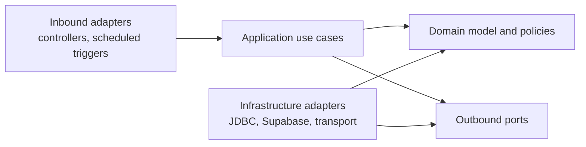

# Platform Module and Dependency Boundaries

Status: Approved design standard
Last updated: 2026-07-25

## Purpose

MyChandha is a modular monolith. Module boundaries organize ownership and
dependencies without creating networked services before workload evidence
exists.

Do not create empty future modules merely to reserve names. A new module begins
only inside an approved phase or domain proposal.

## Current Phase 1 capabilities

| Package capability | Responsibility | Allowed dependencies |
|---|---|---|
| `configuration` | Environment and deployment compatibility configuration | Framework configuration only |
| `identity` | Identity-provider port, Supabase adapter, actor and identity links | Security abstractions and approved persistence ports |
| `security` | HTTP security, permissions, safe errors, correlation | Identity and tenancy application interfaces |
| `tenancy` | Organization context, membership access, tenant transaction binding | Identity value types and persistence abstractions |
| `audit` | Append-only event recording and integrity verification | Tenant transaction boundary |
| `events` | Domain-event contracts, outbox/inbox, durable dispatcher | Tenant transaction boundary and event ports |
| `idempotency` | Request replay protection | Tenant transaction boundary |
| `observability` | Health and metrics adapters | Narrow application/dispatcher status ports |
| `runtime` | API, dispatcher, and migration profile composition | Configuration and module entry points only |

`runtime` was introduced by Gate A and contains only profile composition and
migration-exit behavior.

## Future domain modules

Organization onboarding and event publishing may introduce `organization` and
`event` modules only after Phase 2 design approval. Notification, payments,
finance, media, and other later domains remain absent until their own approval
gates.

## Hexagonal dependency direction

Rules:

- Controllers call application use cases, not JDBC, migrations, or repositories.
- Application use cases coordinate transactions, authorization, domain
  behavior, audit, and outbox publication.
- Domain types do not depend on Spring, JDBC, HTTP, Supabase, Render, or
  provider payloads.
- Outbound ports are owned by the consuming module; infrastructure adapters
  implement them.
- Infrastructure adapters do not become authorization authorities.
- Cross-module use goes through public application interfaces or immutable
  contracts, not another module's internal repository.
- Domain writes and outbox records remain atomic.

## Incremental enforcement

The existing Phase 1 packages predate a complete application/domain/adapter
folder split. The readiness work must not perform a broad cosmetic package
rewrite.

ArchUnit should first enforce:

1. controllers cannot access Spring JDBC or migration code;
2. domain/value-contract packages cannot depend on framework or provider
   packages;
3. dispatcher code cannot depend on controllers;
4. provider adapters remain behind their ports;
5. runtime composition does not leak into domain packages; and
6. future modules follow the full dependency direction from their first commit.

A later refactor must be behavior-preserving, separately reviewed, and backed
by architecture tests. Do not create broad suppressions for existing
violations.
