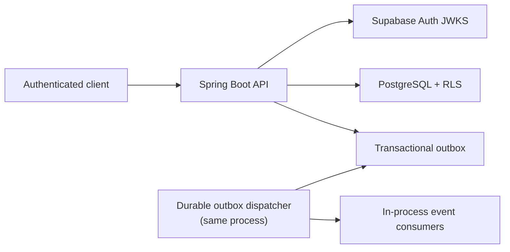
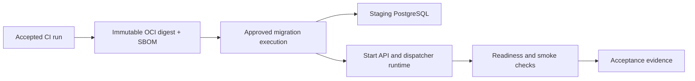

# Phase 1 Platform Foundation Readiness

Status: Design approved
Preparation approved: 2026-07-25
Design decisions approved: 2026-07-25
External-resource approval: Not granted
Gate A repository approval: Granted 2026-07-25
Gate B repository approval: Granted 2026-07-25
Gate B evidence accepted: 2026-07-26
Gate C repository approval: Granted 2026-07-26
Gate C publication/CI acceptance: Not granted
Phase 2: Blocked until this gate closes

## Purpose

This document is the repository-owned decision package for closing the Phase 1
platform foundation. It turns the existing staging acceptance requirements
into an executable, evidence-backed readiness gate.

The package is deliberately limited to capabilities that already exist in
Phase 1 or are necessary to validate them. Reference examples do not become
dependencies or approved providers merely by appearing in a review.

## Gate outcome

The gate closes only when:

1. the required design decisions in this document are approved;
2. any approved repository changes pass the complete CI pipeline;
3. separately approved non-production resources are provisioned;
4. staging acceptance produces the required evidence;
5. every blocking failure is closed or explicitly rejected as unacceptable;
6. the Phase 1 exit report recommends proceeding; and
7. the user explicitly approves Phase 1 closure.

Closing this gate does not approve Phase 2 design or implementation.

## Scope

### Included

- The Java 21 / Spring Boot core API.
- Supabase Auth JWT validation through the existing identity-provider port.
- PostgreSQL tenancy, membership/RBAC, transaction-local tenant binding, and
  Row-Level Security.
- Append-only, reproducible audit evidence.
- Idempotency and the existing PostgreSQL outbox/inbox implementation.
- The existing in-process durable outbox dispatcher.
- OCI image provenance, SBOM, vulnerability and secret-scanning evidence.
- Render as the initial deployment adapter.
- Non-production deployment, acceptance, rollback, restore, and cleanup.

### Excluded

- Phase 2 organization and event-publishing behavior.
- Frontend, CDN, DNS, object storage, payments, messaging, media, and public
  delivery infrastructure.
- Redis, Kafka, or another cache/message broker.
- A generic worker platform. References to a dispatcher mean only the durable
  outbox dispatcher already implemented in Phase 1.
- Production provisioning or production traffic.
- New providers not already approved in `docs/product-decisions.md`.

An excluded capability requires its own evidence, decision, and approval before
it can enter the architecture.

## Infrastructure Decision Record

The following is the Phase 1 baseline. Exact non-production resource names,
regions, plans, costs, owners, and cleanup dates remain unset until the external
resource proposal is reviewed.

| Capability | Approved baseline | Readiness decision | Current state |
|---|---|---|---|
| Application runtime | Cloud-neutral OCI image; Render is the initial adapter | Use the existing image and Render adapter; do not add another compute provider | Blueprint exists; no environment provisioned |
| Database | PostgreSQL with Flyway | Use a non-production managed PostgreSQL instance with TLS, backups, and non-owner runtime roles | V2 and role tests are implemented; no environment has applied them |
| Identity | Pluggable managed OIDC; Supabase Auth first | Use a dedicated non-production Supabase project and validate the configured issuer/JWKS/audience contract | Adapter and automated tests exist; no project selected |
| Durable delivery | PostgreSQL outbox/inbox | Retain the existing dispatcher; do not add Redis, Kafka, or a generic worker tier | Implemented in-process |
| Artifact provenance | OCI image, CycloneDX SBOM, Trivy gate | Deploy an immutable digest produced by the accepted CI run | Gate B `main` CI retains a verified OCI archive; no registry image is published |
| Observability | Actuator health, protected Prometheus, structured logs | Configure staging health, metrics access, alert routing, and log retention | Application signals exist; external routing is not configured |
| Secrets | Environment secrets or an approved secret store | Record ownership, access, and rotation before any value is created | Environment contract exists; governance is not recorded |

### Resource-selection envelope

The external resource proposal must record:

- provider and service type;
- environment and region;
- selected plan and monthly cost estimate;
- accountable owner and authorized operators;
- minimum capacity and scaling trigger;
- TLS, backup, restore, retention, and support capabilities;
- data residency or compliance constraints;
- exit/export procedure; and
- deletion owner and cleanup deadline.

Use capability requirements rather than freezing speculative production sizes.
The region and plan must be justified for the non-production workload and may
change later through an approved decision.

## Runtime topology

### Current Phase 1 runtime

No Phase 1 product webhook or external messaging consumer is active.

### Required deployment sequence

Flyway must not run from a developer laptop against production. For staging and
later production, migrations must be an explicit controlled deployment step
using the migration credential.

### Necessary runtime isolation decision

The API and durable dispatcher currently share one process and database
credential. That does not meet the approved requirement for separate migration,
API, and dispatcher privileges.

The recommended minimal target is:

- one OCI artifact;
- an API execution profile using the API database role;
- a dispatcher execution profile using the dispatcher database role; and
- a one-off migration execution using the migration role.

This is separation of execution profiles for an existing component, not a new
generic worker platform or networked service. Gate A implements this design in
the repository; deployment and external role creation remain unapproved.

Keeping the combined process and shared credential is not acceptable for gate
closure because it would either over-privilege the API or prevent the
dispatcher from performing its cross-organization claim function.

## Database roles and migration ownership

Only the roles required by the current Phase 1 runtime are in scope.

| Role | Purpose | Required access | Prohibited access |
|---|---|---|---|
| Migration role | Apply reviewed Flyway migrations and own schemas/objects | DDL, grants, migration history, approved security routines | Application traffic; routine API execution |
| API role | Serve authenticated and tenant-bound requests | Required DML through RLS; enqueue outbox rows; identity synchronization | Schema ownership, `BYPASSRLS`, unrestricted cross-tenant reads, migration execution |
| Dispatcher role | Claim and transition existing outbox records and invoke in-process consumers | Narrow claim/update operations and required health queries | Schema ownership, general application-table access, unrestricted administration |

Reporting, support, backup, and general read-only application roles are not
created by this gate because Phase 1 has no corresponding runtime use case.
Provider-managed backup identities are documented when the staging plan is
selected.

### Dispatcher access

The current dispatcher directly queries cross-organization outbox rows. A
non-owner role cannot safely do that through the existing RLS policy without
excess privilege.

The recommended design is a small set of versioned, security-definer database
routines for claim and state transitions:

- routines are owned by the migration/object owner;
- the dispatcher receives `EXECUTE` only;
- the routines set an explicit safe `search_path`;
- input and transition rules are validated inside the routines;
- the API role cannot execute cross-tenant dispatcher routines; and
- integration tests prove that the dispatcher cannot access unrelated tenant
  business data.

This design would require a forward-only platform migration and code changes.
It is a proposal for the next repository-change approval, not an implemented
decision.

### Role provisioning

Environment principals and credentials belong to infrastructure bootstrap, not
to source-controlled Flyway migrations. Versioned schema objects, grants to
stable role names, and dispatcher routines belong in reviewed forward-only
Flyway migrations where the selected provider permits that model.

The exact bootstrap mechanism must be approved after the staging PostgreSQL
provider capabilities are confirmed.

## Secrets and configuration governance

Configuration is recorded even when it is not secret. No actual value belongs
in this document.

| Configuration class | Examples | Sensitivity | Owner and storage requirement | Rotation or review trigger |
|---|---|---|---|---|
| API database credential | API JDBC URL, username, password | Secret | Deployment owner; approved environment secret store | Suspected exposure, operator removal, scheduled rotation |
| Migration database credential | Migration URL and credential | High-impact secret | Release owner; available only to approved migration execution | Every access change, suspected exposure, scheduled rotation |
| Dispatcher database credential | Dispatcher URL and credential | Secret | Deployment owner; dispatcher runtime only | Suspected exposure, operator removal, scheduled rotation |
| Supabase validation configuration | Issuer, JWKS URI, audience | Configuration | Identity owner; environment configuration | Project/key change or issuer migration |
| Runtime tuning | Outbox delay, lock timeout, batch and attempts | Configuration | Application owner; versioned defaults plus environment override | Performance evidence or incident review |
| Deployment credential | Registry/deployment authorization | High-impact secret | Release owner; CI environment only | Suspected exposure, trust-policy change, scheduled rotation |

Before provisioning, the external resource proposal must name the accountable
owner, authorized operators, storage system, rotation interval, emergency
rotation procedure, and deletion procedure for every secret class.

## CI and release provenance

### Verified baseline

GitHub Actions run `30085167487` on commit
`b12ff66fc7e4868eebc6b6de9de11951aafb8261` passed:

- Temurin Java 21 verification;
- 21 tests with zero failures, errors, or skips;
- Checkstyle, PMD, JaCoCo, and SpotBugs;
- OCI image build;
- CycloneDX SBOM generation; and
- the configured HIGH/CRITICAL Trivy vulnerability gate.

The Trivy summary reported zero vulnerabilities for the Alpine image and
application JAR. Its secrets column was `-` and defined as not scanned, so the
run does not prove zero secret findings.

### Required before staging deployment

1. Add one explicit, blocking repository/history secret-scanning control.
   Prefer one primary scanner with a documented scope rather than multiple
   overlapping tools without evidence. Enable GitHub native secret scanning
   when the repository plan supports it.
2. Pin third-party GitHub Actions and OCI base images to immutable revisions.
3. Publish the CI-built image to an approved registry and retain its immutable
   digest.
4. Associate the SBOM and verification reports with that digest.
5. Deploy the accepted digest rather than rebuilding an unverified image.
6. Record artifact retention, access, and deletion behavior.

Release signing is a production supply-chain decision. It should be included
in the registry proposal when the chosen registry and trust model are known; it
is not assumed or implemented by this package.

## Security validation plan

Every test must record environment, timestamp, artifact digest, actor/role,
correlation ID where applicable, expected result, actual result, and evidence
location. Evidence must not contain tokens, credentials, raw personal data, or
unsafe database contents.

### Identity

| Validation | Required result |
|---|---|
| Valid non-production Supabase token | Authenticated `/api/v1/platform/me` response |
| Wrong issuer, audience, signature, or malformed token | Generic authentication denial |
| Expired or not-yet-valid token | Generic authentication denial |
| Missing or blank subject | Authentication denial |
| Email or phone changes | No authorization change |

### Tenant and authorization

| Validation | Required result |
|---|---|
| Active member requests own organization | Authorized according to assigned permissions |
| User supplies another organization header | Denied; the header grants no access |
| API role executes without tenant binding | Organization-scoped rows are unavailable |
| API role attempts cross-tenant SQL | RLS denial or zero rows, as appropriate |
| Cross-organization role assignment | Database and application rejection |
| Permission missing or membership inactive | Stable access-denied Problem Details |

### API

| Validation | Required result |
|---|---|
| Invalid organization or correlation header | Safe stable error; no reflection or injection |
| Metrics without `platform.metrics` | Denied |
| CORS policy | Only explicitly approved origins and methods |
| Rate-limit policy | Limits enforced for the agreed endpoint and identity classes |
| CSRF | Recorded as not applicable while the API remains stateless bearer-token only |
| Sensitive command replay | Same request replays; changed request conflicts |

### Data and durable delivery

| Validation | Required result |
|---|---|
| Audit-chain recomputation | Complete valid chain for the test organization |
| Audit update/delete | Rejected |
| Inbox exact replay | Deduplicated |
| Inbox identifier with changed payload | Rejected |
| Outbox successful delivery | Published exactly once to an idempotent consumer |
| Stale dispatcher claim | Reclaimed after timeout |
| Retry exhaustion | Dead-letter state with safe error code |
| API role attempts dispatcher operation | Denied |
| Dispatcher role attempts tenant business-table access | Denied |

### Operations and supply chain

| Validation | Required result |
|---|---|
| Liveness and readiness | Correct routing behavior |
| Protected metrics | Authorized collection only |
| Secret scan | Explicit scanner reports zero unresolved findings |
| Vulnerability scan | No unresolved configured HIGH/CRITICAL findings |
| Backup restore | Restored non-production database passes integrity checks |
| Rollback rehearsal | Prior compatible image becomes ready within the target |
| Forward-fix rehearsal | Database issue is corrected without destructive rollback |
| Log review | No tokens, contact data, stack traces, or unsafe identifiers |

## Deployment and migration strategy

The required order is:

1. identify the accepted commit, OCI digest, SBOM, and reports;
2. verify the approved staging resource and secret inventory;
3. create or select database principals through the approved bootstrap;
4. run the reviewed Flyway migration with the migration role;
5. verify schema version and role grants;
6. start the API and dispatcher profiles with their own credentials;
7. wait for readiness;
8. run identity, tenant, durable-delivery, and observability smoke tests;
9. approve routing only after the smoke evidence passes;
10. monitor errors, readiness, database saturation, and outbox age; and
11. stop and follow the rollback/forward-fix decision when a blocking check
    fails.

No developer-laptop credential may connect to production for migration. A
staging emergency action must also be auditable and use an explicitly approved
credential.

## Rollback, recovery, and cleanup

### Application rollback

- Retain the last accepted immutable image digest.
- Roll back only when the database schema is compatible with that image.
- Verify readiness, authentication, tenant denial, and outbox health after the
  rollback.

### Database correction

- Flyway migrations are forward-only.
- Do not automatically reverse a deployed migration.
- Use a reviewed forward-fix unless a separately approved restore is necessary.
- Record data compatibility and audit-chain impact before any restore.

### Recovery

The current production targets are an RPO of 5 minutes and RTO of 60 minutes.
Staging must rehearse restore and recovery against those targets or record why
the selected non-production plan cannot do so.

The external resource proposal must name:

- the incident commander;
- the database restore operator;
- the application rollback operator;
- the Supabase recovery owner;
- the evidence recorder; and
- the person authorized to declare recovery complete.

Names are intentionally not invented in this design package.

### Cleanup

Before creation, every resource needs:

- a deletion owner;
- a planned deletion date or retention condition;
- export requirements;
- secret revocation steps;
- database and backup deletion behavior; and
- evidence that cleanup completed.

## Evidence index

The Phase 1 exit report must reference, without copying secrets:

- accepted commit and CI run;
- OCI digest and registry location;
- SBOM and scan artifacts;
- approved resource and cost inventory;
- database role/grant evidence;
- migration execution record;
- JWT and tenant-isolation results;
- audit, idempotency, inbox, and outbox results;
- health, metrics, alert, and log evidence;
- backup/restore and rollback evidence;
- open risks and disposition; and
- cleanup plan.

## Approved design directions

The user approved the open design decisions on 2026-07-25:

1. separate API, dispatcher, and migration execution profiles;
2. security-definer dispatcher access with least-privilege runtime roles;
3. an immutable registry digest as the deployment identity;
4. an explicit blocking secret scanner;
5. later selection of exact non-production resources through a separate
   proposal; and
6. later verification and approval of the selected plans' rate-limit,
   alerting, backup, log-retention, and restore capabilities.

The approval establishes the required controls. It does not invent or approve
resource names, regions, plans, costs, owners, credentials, or external
changes. The concrete repository scope and recommended registry/scanner are in
`docs/phase-1-repository-change-proposal.md`.

The accepted decisions and engineering standards are recorded in
`docs/adr/`, `docs/module-boundaries.md`, `docs/observability-standards.md`,
`docs/api-contract.md`, and `docs/developer-experience.md`.

Deployment readiness is additionally governed by the provider-neutral
`MCDC-001` specification and environment capability matrix in
`docs/deployment-contract.md`. Gate evidence uses `EP-001` in
`docs/evidence-package.md`, and approval progression follows `CC-001` in
`docs/change-control.md`.

## Expected repository-change impact

The repository-change proposal covers:

- API, dispatcher, and migration execution profiles;
- disabling Flyway for runtime profiles;
- a forward-only platform migration for dispatcher access and grants;
- Testcontainers coverage for the real role boundaries;
- CI secret scanning and immutable dependency/action pinning;
- publishing and deploying an immutable image digest;
- Render blueprint or deployment-runbook changes;
- operations and evidence-record updates.

Gate A implements the runtime, migration, security-routine, contract, test, and
developer-experience subset while preserving the existing product behavior and
Phase 1 security invariants. Gate B is accepted. Gate C is implemented locally;
repository publication and CI evidence acceptance remain separate approval
steps.

## Approval sequence

1. Complete Gate A Docker-backed verification and accept its green CI evidence
   — completed 2026-07-25.
2. Review and separately approve or reject Gate B — merged as
   `e34239f34056ea1b6bf5769e5e7920a8ceedf053`, post-merge `main` CI run
   `30166358486` passed, and evidence was accepted 2026-07-26.
3. Review, refine, approve, and implement Gate C locally — completed
   2026-07-26; local evidence is
   `docs/phase-1-gate-c-evidence.md`.
4. Approve repository publication, obtain green CI evidence, and explicitly
   accept or reject Gate C.
5. Review and approve the exact external resource proposal.
6. Provision non-production resources and execute staging acceptance.
7. Review the Phase 1 exit report and explicitly close or reject Phase 1.
8. If Phase 1 closes, request a separate approval to prepare the Phase 2
   design.
